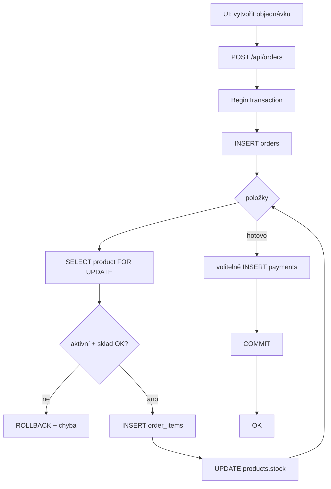
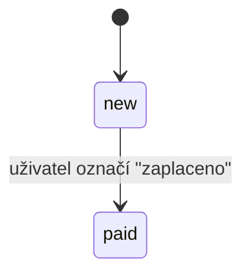
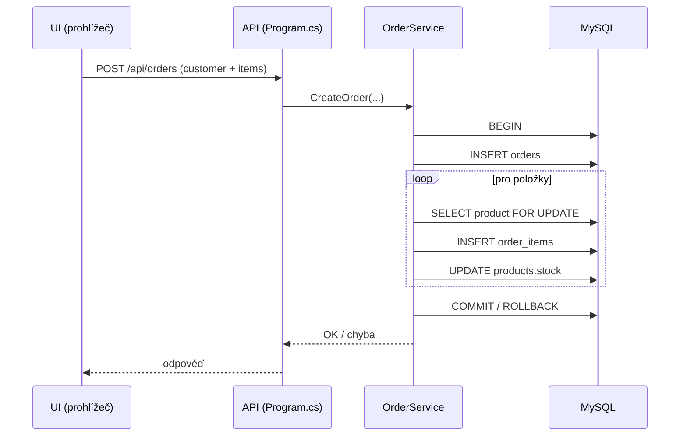
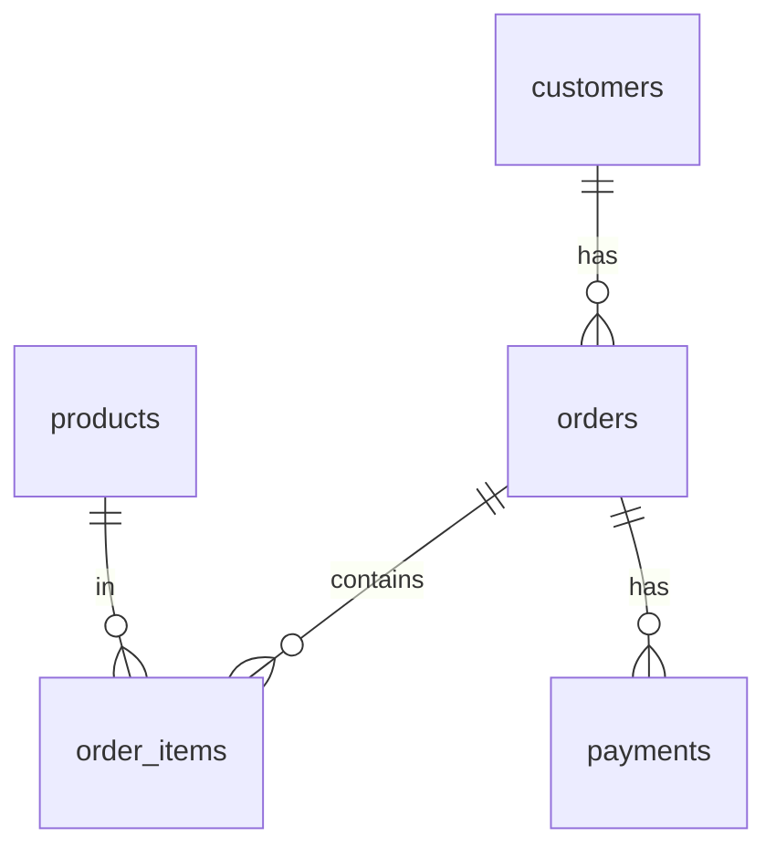

# Databázová aplikace – OrderSystem (objednávkový systém)

## 1. Základní informace

**Název projektu:** OrderSystem (objednávkový systém)  
**Autor:** Martin Landa  
**Kontakt:** landa2@spsejecna.cz  
**Škola:** SPŠE Ječná  
**Datum vypracování:** 10.1. 2026  
**Typ projektu:** Školní databázový projekt 

---

## 2. Specifikace požadavků uživatele (Use Case)

### Funkční požadavky
- **Evidence entit:** Kompletní správa (vložení, úprava, smazání, zobrazení) zákazníků a produktů.
- **Transakční operace:** Vytvoření objednávky v jedné operaci, která atomicky zapisuje do více tabulek a upravuje sklad.
- **Reporting:** Generování souhrnných statistik (top zákazníci, prodeje produktů, součty objednávek) pomocí agregací a DB pohledů.
- **Import dat:** Hromadné naplnění databáze importem – zákazníci z **CSV**, produkty z **JSON**.
- **Konfigurovatelnost:** Externí nastavení připojení k DB v konfiguračním souboru bez zásahu do zdrojového kódu.
- **Ošetření chyb:** Srozumitelná hlášení při chybě konfigurace, DB spojení, validace a transakcí.

### Databázové požadavky a integrita
Aplikace využívá **MySQL** a splňuje technické parametry zadání:
- **Struktura:** Min. 5 tabulek propojených vazbami včetně vazební tabulky pro relaci **M:N**.
- **Datové typy:** zastoupení `FLOAT` (rating), `BOOL` (is_active / paid), `VARCHAR` (texty), `DATETIME` (created_at), a simulace výčtu přes **CHECK**:
  - `state varchar(20) check(state in ('new','paid')) not null`
- **Views:** 2 DB pohledy pro reporty (viz kapitola 5).

### Use Case – přehled
**Správa zákazníků (Customers)**
- Zobrazit zákazníky (list)
- Přidat zákazníka
- Upravit zákazníka (prázdné pole = beze změny)
- Smazat zákazníka

**Správa produktů (Products)**
- Zobrazit produkty (list)
- Přidat produkt
- Upravit produkt (prázdné pole = beze změny)
- Smazat produkt
- Nastavit produkt jako aktivní/neaktivní  
  (neaktivní produkt nelze použít v objednávce)

**Objednávky (Orders)**
- Zobrazit objednávky
- Vytvořit objednávku transakčně (zákazník + položky)
- Označit objednávku jako zaplacenou (checkbox)
- Smazat objednávku

**Import dat**
- Import zákazníků z CSV
- Import produktů z JSON

**Reporty**
- Top zákazníci
- Prodeje produktů
- Součty objednávek

---

## 3. Architektura aplikace

Zpracovávaná verze zadání je **D1 – Repository pattern**.  
Projekt je realizován jako webová aplikace v **ASP.NET Core (Minimal API)** s webovým UI v prohlížeči.  
Pro práci s DB je použita vlastní repository vrstva (SQL dotazy v C#), bez hotového ORM.

### Struktura aplikace (vrstvy)
- **UI (wwwroot)** – HTML/JS/CSS stránky, které volají REST API.
- **API (Program.cs)** – endpointy (Customers, Products, Orders, Import, Reports).
- **Services** – business logika (hlavně transakce pro objednávku).
- **Repositories** – přístup k DB (Repository pattern).
- **MySQL DB** – tabulky + views.

### Struktura projektu (orientačně)
```text
Ordersystem/
├─ src/
│  └─ OrderSystem.Web/
│     ├─ Program.cs
│     ├─ appsettings.json
│     ├─ Models/
│     ├─ Dto/
│     ├─ Data/
│     │  ├─ MySqlConnectionFactory.cs
│     │  └─ Repositories/
│     ├─ Services/
│     └─ wwwroot/
├─ sql/
│  └─ db.sql
├─ import/
│  ├─ customers.csv
│  └─ products.json
└─ scripts/
   └─ run.bat
```

### Použité principy
- Relační databázový model (MySQL)
- Integritní omezení (PK, FK, UNIQUE, CHECK)
- Využití **views** pro reporty
- Repository pattern (D1)
- Dependency Injection (registrace repository/service)
- Transakce (COMMIT / ROLLBACK)

### Vztahy mezi entitami
- Zákazník **1:N** Objednávka  
- Objednávka **M:N** Produkt (mezitabulka **order_items**)  
- Objednávka **1:N** Platba  

### Použité knihovny třetích stran
- **MySqlConnector** – driver pro MySQL (není ORM).
- **Swashbuckle.AspNetCore** – Swagger UI pro API dokumentaci.

---

## 4. Chování aplikace

### 4.1 Logický průběh vytvoření objednávky (transakce)
Vytvoření objednávky je realizováno jako transakční operace nad více tabulkami:

1. **Založení objednávky:** `INSERT` do tabulky `orders` (vznikne `order_id`).
2. **Zpracování položek (pro každou položku):**
   - `SELECT ... FOR UPDATE` nad `products` (zamčení řádku produktu).
   - kontrola: produkt existuje, je **aktivní**, a je dostatečný **sklad**.
   - `INSERT` do `order_items`.
   - `UPDATE products` (odečet skladu).
3. **Volitelná platba:** pokud je vyplněna, `INSERT` do `payments`.
4. **Změna stavu:** pokud je označeno jako zaplacené, nastaví se `orders.state='paid'`.
5. **Potvrzení:** pokud vše proběhne OK → `COMMIT`; při chybě → `ROLLBACK`.

> Výsledek: buď se uloží **vše**, nebo **nic** (nevzniknou nekonzistentní data).



### 4.2 Stavový model objednávky
Stav objednávky je uložen ve sloupci `orders.state` a je omezen pomocí CHECK constraint:
- `new` – Nová
- `paid` – Zaplacená



### 4.3 Interakce vrstev (zjednodušeně)
Příklad: vytvoření objednávky
1. UI odešle request na API.
2. API zavolá `OrderService`.
3. `OrderService` provede transakci a používá SQL operace nad tabulkami.
4. Výsledek se vrátí do UI.



### 4.4 Uživatelské rozhraní
Aplikace používá jednoduché webové UI (stránky v `wwwroot`). Navigace je řešena tlačítky v horní části.

| Stránka | Popis | Pracuje s tabulkami |
| :--- | :--- | :--- |
| **Zákazníci** | CRUD zákazníků | `customers` |
| **Produkty** | CRUD produktů, aktivní/neaktivní | `products` |
| **Objednávky** | transakční vytvoření, zaplaceno, smazání | `orders`, `order_items`, `products`, `payments` |
| **Import dat** | CSV/JSON import | `customers`, `products` |
| **Reporty** | agregace/reporty | `v_product_sales`, `v_order_totals` (+ joiny) |

---

## 5. E-R model databáze

### customers
- `id` (int, PK)  
- `first_name` (varchar)  
- `last_name` (varchar)  
- `email` (varchar, UNIQUE)  
- `phone` (varchar, NULL)  
- `created_at` (datetime)  

### products
- `id` (int, PK)  
- `name` (varchar, UNIQUE)  
- `price` (decimal)  
- `stock` (int)  
- `is_active` (bool)  
- `rating` (float, NULL)  
- `created_at` (datetime)  

### orders
- `id` (int, PK)  
- `customer_id` (int, FK → customers)  
- `state` (varchar(20), CHECK 'new'/'paid')  
- `note` (varchar, NULL)  
- `created_at` (datetime)  

### order_items (M:N)
- `order_id` (int, FK → orders)  
- `product_id` (int, FK → products)  
- `quantity` (int)  
- `unit_price` (decimal)  
**PK:** (`order_id`, `product_id`)

### payments
- `id` (int, PK)  
- `order_id` (int, FK → orders)  
- `amount` (decimal)  
- `provider` (varchar)  
- `paid` (bool)  
- `paid_at` (datetime, NULL)  

### Views
- `v_order_totals` – součty objednávek (agregace)
- `v_product_sales` – prodeje produktů (agregace)



---

## 6. Import a export dat

Aplikace umožňuje import dat do dvou tabulek:
- Import zákazníků do `customers` z **CSV**
- Import produktů do `products` z **JSON**

### Import zákazníků (CSV)
Soubor musí mít hlavičku:
- `first_name,last_name,email,phone`

### Import produktů (JSON)
Pole objektů, např.:
- `name`, `price`, `stock`, volitelně `rating`, `isActive`

Export dat z DB není v aplikaci implementován (pro odevzdání stačí SQL skripty a případně export přes Workbench).

---

## 7. Konfigurace

Aplikace používá konfigurační soubor `src/OrderSystem.Web/appsettings.json`.

- Klíčová hodnota: `ConnectionStrings:Default`
- Pro testera je připraven `appsettings.example.json` (vzor).

Pokud je konfigurace špatná (heslo, host, port, DB), aplikace nedokáže navázat spojení a vrátí chybu (viz kapitola 9).

---

## 8. Instalace a spuštění
- Detailněji je postup popsaný v **README.md**.
1. Otevřít **MySQL Workbench** a spustit skripty:
   - `sql/db.sql`
2. Nastavit připojení v `appsettings.json`.
3. Spustit aplikaci přes `scripts/run.bat` (bez IDE).
4. Otevřít web v prohlížeči (URL vypíše konzole).

---

## 9. Chybové stavy a jejich řešení

### 9.1 Technické a konfigurační chyby
- **MySQL server neběží:** aplikace se nepřipojí → spustit MySQL službu.
- **Špatné heslo / uživatel / port:** upravit `appsettings.json`.
- **Chybí DB / tabulky:** znovu spustit `sql/01_schema.sql` + `sql/02_views.sql`.
- **Port webu obsazen:** spustit znovu / změnit port podle nastavení ASP.NET.

### 9.2 Validační a logické chyby
- **Duplicitní email zákazníka:** porušení UNIQUE → změnit email.
- **Duplicitní název produktu:** porušení UNIQUE → změnit název.
- **Neplatné hodnoty (cena, sklad, množství):** aplikace odmítne request.

### 9.3 Databázová integrita a transakce
- **Nedostatek skladu:** objednávka se nevytvoří a proběhne `ROLLBACK`.
- **Neaktivní produkt:** objednávka se nevytvoří (blokace v UI i na backendu).
- **Chyba v polovině objednávky:** transakce zabrání částečnému uložení.

---

## 10. Závěrečné resumé

Projekt **OrderSystem** je kompletní databázové řešení pro jednoduchou správu objednávek.  
Databáze je navržena s důrazem na integritu dat, validaci a přehlednou strukturu a splňuje všechny požadavky ze zadání.
